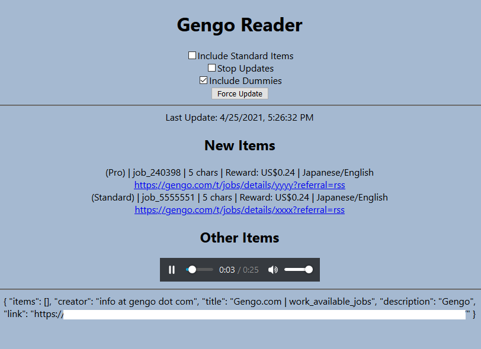

# gengo-rss-reader

Web app to read RSS feed for jobs on Gengo.com. Uses React front-end and Express back-end.

## Setup

- `npm install`
- `npm run build`
- `npm run serve`
- Go to http://localhost:5000

## Sample picture

